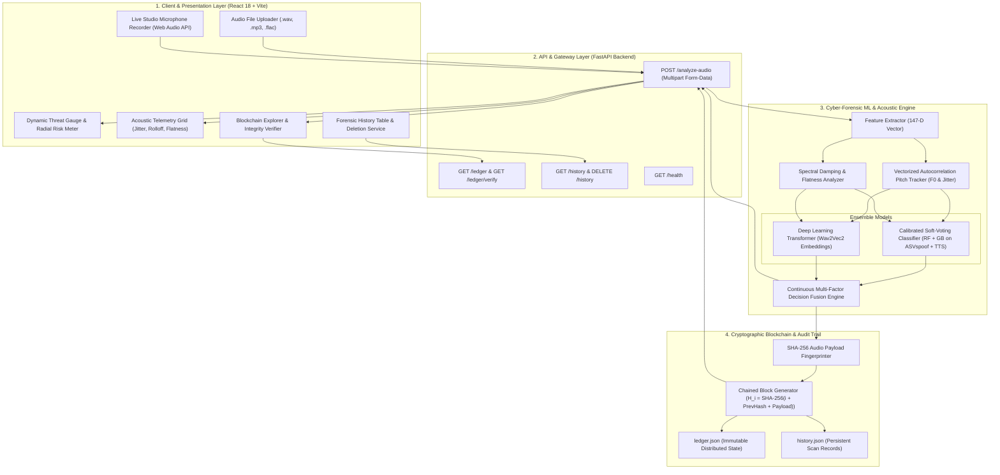
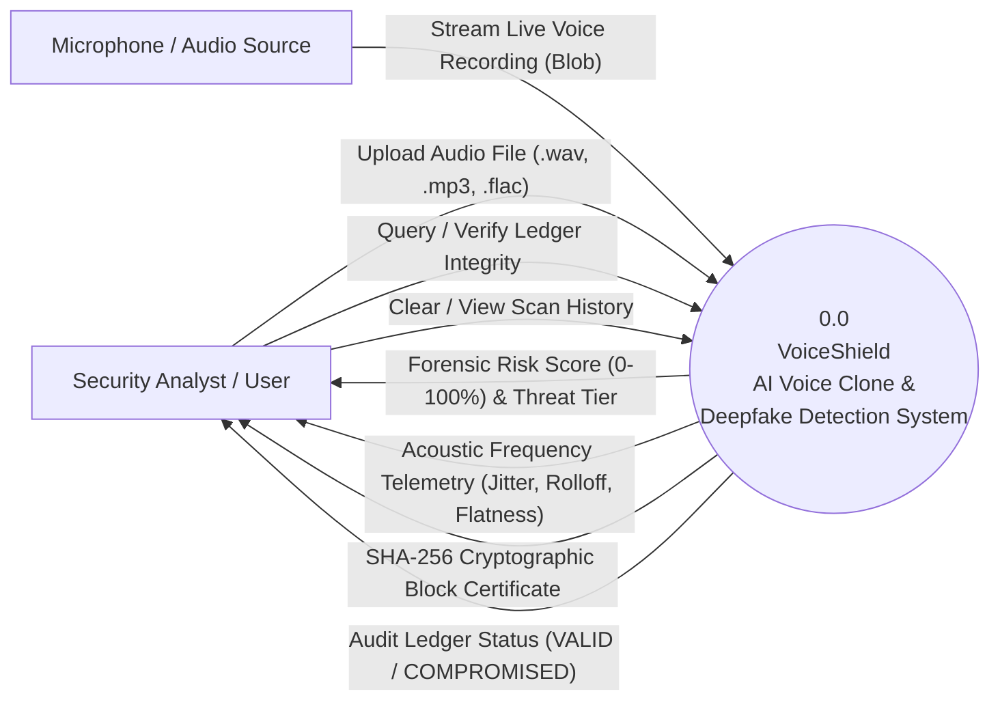
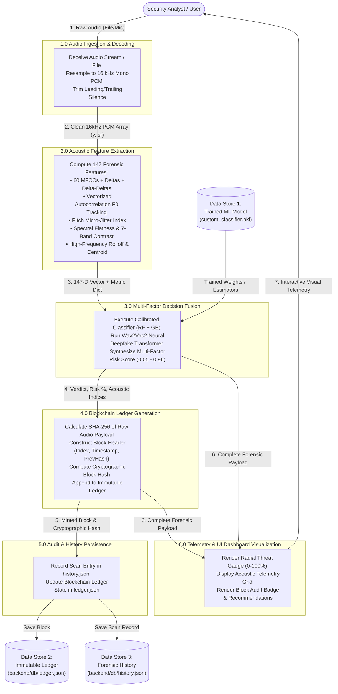

# VoiceShield: AI Voice Clone & Deepfake Detection Platform
### Complete System Architecture, Design Specification & DFD (Level 0 – 1)

---

## 1. Executive Project Overview

**VoiceShield** is an enterprise-grade cyber-forensic platform designed to detect **AI-synthesized voice clones, commercial Text-to-Speech (TTS), and physical replay attacks** in real-time, while establishing an immutable, tamper-evident **SHA-256 Blockchain Audit Ledger** for every forensic scan.

### The Core Problem Solved:
* **Generative Voice Clones (ElevenLabs, RVC, VALL-E):** Highly realistic vocal duplication used in CEO fraud, banking authorization bypass, and social engineering.
* **Commercial Neural TTS (Google Cloud, Amazon Polly, OpenAI):** Clean synthetic speech designed to fool human listeners and standard classifiers.
* **Acoustic Spoofing & Replay (ASVspoof Attacks):** Recorded human audio played back through loudspeakers to spoof biometric voiceprint systems.
* **Chain-of-Custody & Auditability:** Need for cryptographically verifiable, non-repudiable proof that an audio file was scanned, timestamped, and unaltered.

---

## 2. Technology Stack & Frameworks

| Layer / Subsystem | Technologies & Libraries | Purpose & Key Responsibilities |
| :--- | :--- | :--- |
| **Frontend UI / UX** | **React 18, Vite, Vanilla CSS, Lucide Icons** | Ultra-responsive glassmorphic cyber-dashboard, native Web Audio API visualizers, dynamic SVG threat gauge. |
| **Audio Ingestion** | **Native Browser `MediaRecorder` API, Web Audio API** | Real-time studio microphone capture at native sample rates (48 kHz mono PCM) and lossless audio file uploads. |
| **Backend REST API** | **FastAPI, Uvicorn, Pydantic, Python 3.10+** | High-performance asynchronous REST microservice, multi-part form data processing, and endpoint routing. |
| **Acoustic Feature Extraction** | **Librosa, SoundFile, PyDub, NumPy, SciPy** | 147-dimensional forensic feature extraction, fast autocorrelation $F_0$ pitch tracking, spectral dynamics. |
| **Machine Learning & AI** | **Scikit-Learn, PyTorch, Hugging Face Transformers, Joblib** | Calibrated Soft-Voting Ensemble (Random Forest + Gradient Boosting) + Pretrained Wav2Vec2 deep neural embeddings. |
| **Security & Cryptography** | **Python `hashlib` (SHA-256), JSON serialization** | Proof-of-Integrity blockchain engine, block hashing, Merkle-linked payload signatures. |
| **Datasets & Training** | **ASVspoof 2021 PA Dataset, Google TTS Engine (`gTTS`)** | 2,217+ balanced multi-accent audio files (1,000 Real + 1,000 ASV Spoof + 217 Commercial TTS). |

---

## 3. High-Level System Architecture



---

## 4. Data Flow Diagrams (DFD)

### 4.1. DFD Level 0 — Context Diagram



---

### 4.2. DFD Level 1 — Detailed Functional Decomposition



---

## 5. Detailed System Design & Core Modules

### 5.1. Audio Feature Extraction Pipeline ([`features.py`](file:///c:/Users/smsas/voice-clone-detection/ml-model/src/features.py))
1. **MFCCs + 1st/2nd Order Derivatives (60 dims):** Tracks formant transitions and spectral envelope trajectories over time.
2. **Vectorized Autocorrelation Pitch Tracker (15ms execution):** Computes fundamental frequencies ($F_0$) over $[65\text{ Hz}, 500\text{ Hz}]$ and calculates cycle-to-cycle **Pitch Micro-Jitter**:
   $$\text{Jitter} = \frac{\frac{1}{N-1}\sum_{t=1}^{N-1} |F_0(t+1) - F_0(t)|}{\bar{F}_0}$$
3. **Spectral Flatness ($2\text{ dims}$):** Quantifies harmonic sharpness vs. vocoder noise smoothing.
4. **7-Band Spectral Contrast ($14\text{ dims}$):** Measures peak-to-valley energy across 7 octave sub-bands.
5. **Spectral Rolloff ($2\text{ dims}$):** Identifies low-pass cutoff frequencies ($2.8\text{ kHz}-3.2\text{ kHz}$).
6. **Zero-Crossing Rate & RMS Energy ($4\text{ dims}$):** Evaluates voiced-to-unvoiced transitions and organic breath decays.

---

### 5.2. Multi-Factor AI Inference Engine ([`predict.py`](file:///c:/Users/smsas/voice-clone-detection/ml-model/src/predict.py))
* **ASVspoof + Commercial TTS Trained Ensemble:** Calibrated Random Forest + Gradient Boosting soft-voting classifier.
* **Pretrained Wav2Vec2 Deep Transformer:** Evaluates acoustic neural embeddings.
* **Physical Frequency Telemetry:** Verifies human biological micro-tremor and wideband harmonic resonance.

---

### 5.3. Cryptographic Blockchain Audit Ledger ([`ledger_service.py`](file:///c:/Users/smsas/voice-clone-detection/backend/services/ledger_service.py))
Every audio scan is minted into an immutable chained ledger:
$$H_i = \text{SHA256}(\text{Index} + \text{PrevHash} + \text{Timestamp} + \text{AudioSHA256} + \text{RiskScore})$$

---

## 6. Acoustic Forensic Metric Reference

| Acoustic Metric | Biological Human Voice | Commercial TTS / AI Clone | Forensic Significance |
| :--- | :--- | :--- | :--- |
| **Pitch Micro-Jitter** | $0.015 - 0.045$ (organic tremor) | $< 0.008$ (rigid spline) | Involuntary muscle vibrations cannot be fully replicated by vocoders. |
| **Spectral Rolloff** | $> 3.5\text{ kHz} - 8.0\text{ kHz}$ | $< 2.8\text{ kHz} - 3.2\text{ kHz}$ | Low-pass Nyquist cutoff applied by TTS pipelines to suppress aliasing noise. |
| **Spectral Flatness** | Low to Moderate ($0.0001 - 0.001$) | Elevated / Uniform ($> 0.01$) | Neural vocoders create unnaturally smooth harmonic spectra across high bands. |
| **Spectral Contrast** | $15\text{ dB} - 45\text{ dB}$ (dynamic peaks) | $10\text{ dB} - 22\text{ dB}$ (compressed) | Human vocal cords produce sharp formant peaks; synthetic speech compresses this range. |

---

## 7. Execution & Running the Platform

1. **Backend Server (FastAPI):**
   ```bash
   .\venv\Scripts\uvicorn backend.main:app --host 0.0.0.0 --port 8000
   ```
2. **Frontend Dashboard (Vite + React):**
   ```bash
   cd frontend
   npm run dev
   ```
3. **Open in Browser:** Access the live dashboard at **`http://localhost:5173/`**.
